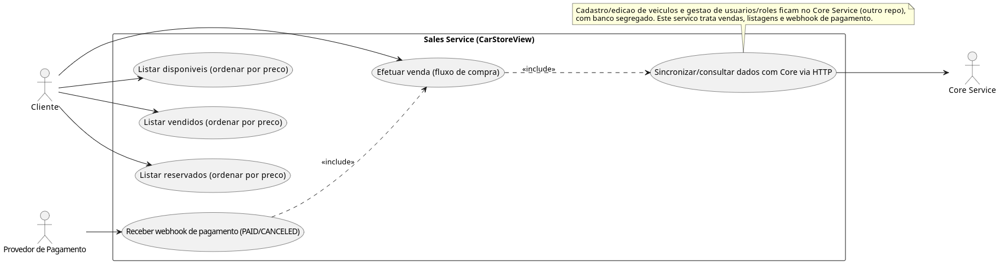
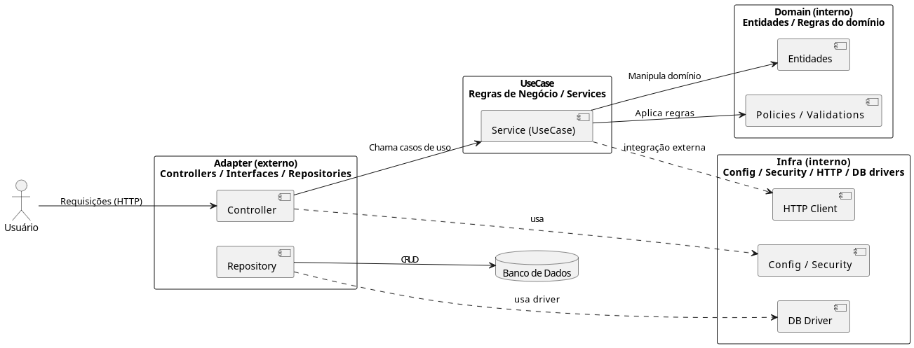
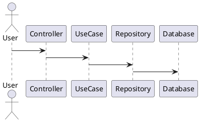
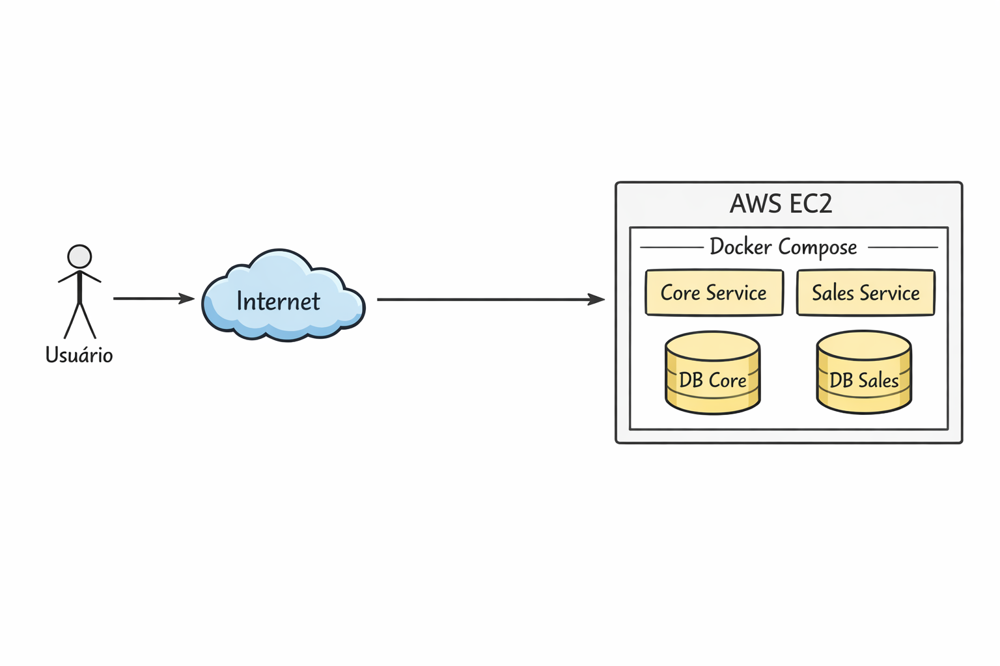
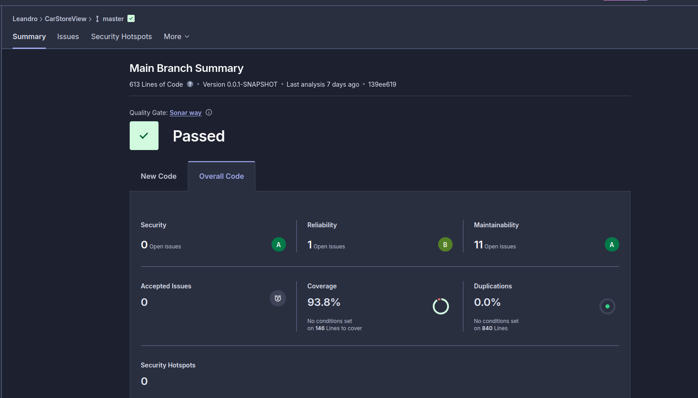

# 🟢 CarStoreView (Sales Service) — Serviço de Vendas

Este repositório contém o **CarStoreView**, o microsserviço dedicado ao **fluxo de venda e consultas de venda** (listagens), desenvolvido em **Spring Boot** seguindo **Clean Architecture**, com testes automatizados e pipeline completo de **CI/CD**.

> **Responsabilidades deste microserviço (Sales Service):**
> - **Efetuar a venda** de um veículo (fluxo de compra).
> - **Listar veículos disponíveis e vendidos**, ordenando por preço (do mais barato para o mais caro).
> - **Receber o webhook de pagamento** (confirmação/cancelamento), atualizando o estado da venda.
> - **Comunicar-se com o Core Service via HTTP** para sincronizar/consultar informações necessárias ao domínio.
>
> O **cadastro/edição de veículos** e a **gestão de usuários/roles** ficam no **Core Service** (outro repositório), com banco segregado.



---

## 📦 FASE 4 — Contexto do Projeto

A plataforma foi projetada para suportar aumento repentino de chamadas, isolando endpoints de **listagem** e **compra** em um serviço único (**CarStoreView**), com **banco de dados segregado**.

A comunicação entre serviços ocorre via **HTTP REST**, respeitando os limites de responsabilidade de cada componente.

---

## 🧱 Clean Architecture

Estrutura em camadas:

```
adapter   → Controllers e interfaces externas
usecase   → Regras de negócio
data      → DTOs e persistência
infra     → Configurações (DB, segurança, clientes HTTP)
```




### 📐 Diagrama (Clean Architecture)



---

## 🏗️ Microsserviços (visão macro)

```plantuml
@startuml
actor Cliente

rectangle "Core Service" as core
rectangle "CarStoreView (Sales Service)" as view

database "DB Core" as dbcore
database "DB View" as dbview

Cliente -> core : Cadastro/edição
Usuários e veículos
core -> dbcore

core -> view : HTTP REST
(solicita venda/sincronização)
view -> dbview
view -> core : HTTP REST
(notifica/consulta Core)
@enduml
```



---

## ▶️ Executando Localmente

### ✅ Pré-requisitos
- Java 24
- Docker + Docker Compose
- Git

### 🐳 Rodar com Docker (recomendado)

```bash
docker compose up --build
```

### 💻 Rodar sem Docker (banco em Docker + app local)

Subir somente o banco (ajuste o nome do serviço conforme seu compose):
```bash
docker compose up db -d
```

Subir a aplicação local:
```bash
./mvnw spring-boot:run
```

### 📄 Variáveis de ambiente (mínimo)

Para rodar local, estas variáveis precisam estar configuradas (exemplo):

```bash
export SERVER_PORT=8081
export DB_URL="jdbc:postgresql://localhost:5433/carstore_view"
export DB_USER="view_user"
export DB_PASS="view_pass"
export FLYWAY_ENABLED=true
export JPA_DDL_AUTO=validate
export CORE_BASE_URL="http://localhost:8080"
export JWT_PUBLIC_KEY="<BASE64_DO_PEM_DA_CHAVE_PUBLICA_RSA>"
```

---


## 🔐 Autenticação (JWT)

> ✅ **Não existe mais a pasta `keys/` neste projeto.**

O **CarStoreView** valida JWT usando uma **chave pública RSA** informada via variável de ambiente:

- `JWT_PUBLIC_KEY`: **Base64** do conteúdo PEM da chave pública (`-----BEGIN PUBLIC KEY----- ...`).

Exemplo (Linux/Mac) para gerar o Base64 do PEM:

```bash
base64 -w 0 public_key.pem
```

Depois exporte:

```bash
export JWT_PUBLIC_KEY="<COLE_AQUI_O_BASE64_DO_PEM>"
```


## 📖 Swagger / OpenAPI

Após subir a aplicação, acesse:

- **Swagger UI:** `http://localhost:8081/swagger-ui/index.html`
- **OpenAPI JSON:** `http://localhost:8081/v3/api-docs`

---

## 🧪 Testes

```bash
./mvnw test
```

---

## 🔄 CI/CD (GitHub Actions)

Este repositório utiliza GitHub Actions para:

- Executar testes automaticamente
- Analisar qualidade (SonarCloud)
- Build Docker
- Push da imagem para Amazon ECR
- Deploy automático na EC2 com Docker Compose

### ✅ Gatilho do pipeline

O workflow é disparado quando ocorre **push/merge na branch `main`**:
- **Merge de Pull Request → main** (recomendado)
- **Push direto → main** (também dispara)

Fluxo (alto nível):
```
push na main → testes → sonar → build docker → push ECR → deploy EC2
```

---

## 🔐 Criar Secrets via CLI (gh) para o Actions

### 1) Autenticar
```bash
gh auth login
```

### 2) Criar secrets manualmente (exemplo)
```bash
gh secret set SERVER_PORT --body "8081"
gh secret set CORE_BASE_URL --body "http://localhost:8080"
```

### 3) Importar em lote a partir do `.env` (recomendado)
Se você tiver o script `import-secrets.sh`:
```bash
chmod +x import-secrets.sh
./import-secrets.sh
```

---

## 🔐 Nota de Segurança (Contexto Acadêmico)

Este projeto utiliza **chave pública JWT** para validação de tokens.  
No contexto acadêmico, arquivos de chave usados apenas para desenvolvimento podem existir no repositório, mas **não devem ser usados em produção**.

---

## 📚 Tecnologias
- Java 24
- Spring Boot
- PostgreSQL
- Docker / Docker Compose
- PlantUML
- GitHub Actions
- SonarCloud
- JUnit + Mockito

---

## 👨‍💻 Autor

Leandro Shiniti Tacara  
RM355388  
Pós Tech FIAP — Turma SOAT7


## ☁️ Requisitos para execução na AWS (EC2)

Para executar e publicar via CI/CD (GitHub Actions) em uma instância EC2:

- **Instância**: `t3.small`
- **EC2 com IP público** (Elastic IP opcional, mas recomendado para estabilidade)
- **Docker + Docker Compose** instalados na EC2
- **Security Group** liberando:
  - **SSH (22)** a partir do seu IP (administração)
  - **Portas da aplicação** (ex.: `8080` no Core, `8081` no Sales)
  - Permitir o deploy do **GitHub Actions** (via SSH) — recomenda-se restringir a origem aos **GitHub Actions IP ranges** ou usar **runner auto-hospedado** na própria VPC
- **IAM Role** anexada à EC2 (mínimo necessário) para permitir operações usadas no deploy (ex.: pull de imagens no ECR, leitura de secrets/params, etc., conforme seu pipeline)


## 🗃️ Banco de dados e migrações (Flyway)

Este projeto utiliza **PostgreSQL** e possui **migrações Flyway** em `src/main/resources/db/migration`.
Ao subir a aplicação, o Flyway executa as migrations automaticamente (por padrão).


## 👤 Usuário admin padrão (para testes)

Ao iniciar a aplicação, é criado automaticamente um **usuário admin padrão** para facilitar os testes ponta-a-ponta.

> **Ajuste via variáveis de ambiente** (ver `application.yml` / `application.yaml`).


## ✅ Evidências do Sonar / Cobertura


- Quality Gate
- Cobertura total (>= 80%)
- Execução dos testes no pipeline


## 🧩 Diagrama de Caso de Uso (descrição)

A seguir está uma descrição textual para você montar o **Diagrama de Caso de Uso** (UML):

### Atores
- **Administrador**: usuário interno que cadastra e edita veículos e gerencia usuários.
- **Cliente/Comprador**: usuário que realiza a compra (fluxo de venda).
- **Gateway de Pagamento**: sistema externo que chama o webhook informando o status do pagamento.

### Casos de uso (alto nível)
1. **Cadastrar veículo para venda**
   - Ator: Administrador
   - Resultado: veículo cadastrado como disponível para venda.

2. **Editar dados do veículo**
   - Ator: Administrador
   - Resultado: dados do veículo atualizados.

3. **Efetuar venda (compra) de veículo**
   - Ator: Cliente/Comprador
   - Pré-condição: veículo está disponível
   - Resultado: venda criada/registrada com CPF do comprador e data da venda.

4. **Processar confirmação/cancelamento de pagamento (Webhook)**
   - Ator: Gateway de Pagamento
   - Entrada: código do pagamento + status (PAID/CANCELED)
   - Resultado: venda atualiza o status (confirmada ou cancelada).

5. **Listar veículos à venda (ordenado por preço)**
   - Ator: Cliente/Comprador
   - Resultado: lista ordenada do mais barato para o mais caro.

6. **Listar veículos vendidos (ordenado por preço)**
   - Ator: Administrador (ou usuário interno)
   - Resultado: lista ordenada do mais barato para o mais caro.

### Observação de arquitetura
- O **fluxo de compra e listagens** fica isolado no **Sales Service (CarStoreView)** com **banco segregado**.
- O **cadastro/edição** e demais funcionalidades ficam no **Core Service (CarStoreBack)**.
- A comunicação entre os serviços acontece via **HTTP**.

